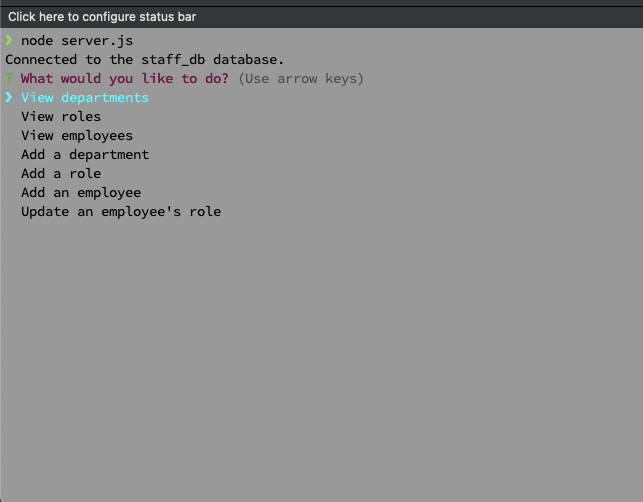
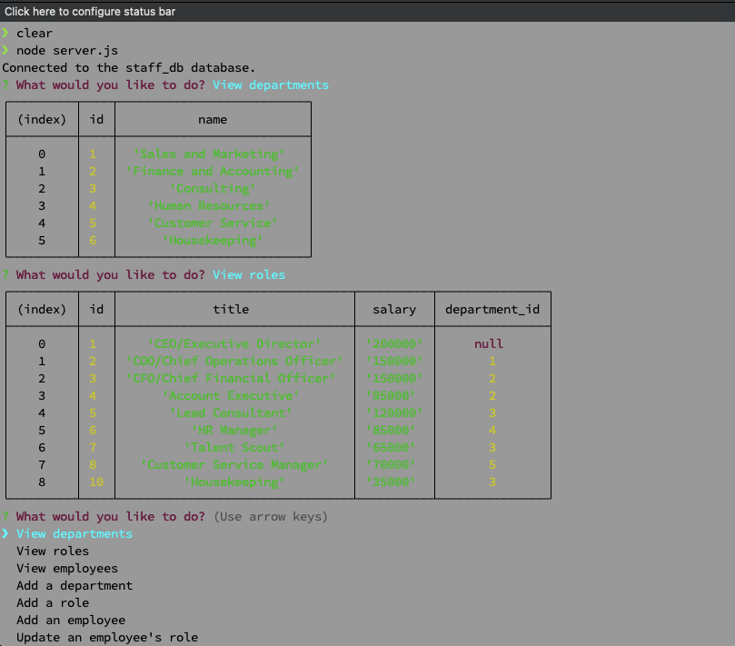
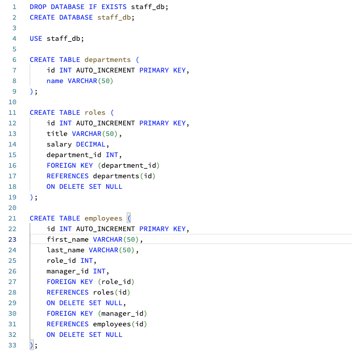

# Employee Tracker

## Description 

Employee Tracker is a powerful command-line application built using Node.js, Inquirer, and MySQL, designed to help companies keep track of their employees, departments, and roles. With this application, users can easily view, add, and update information about employees, roles, and departments. 

This application offers a range of features, including the ability to view all departments, add or remove departments, view all roles, add or remove roles, view all employees, and view employees by department or manager. It simplifies the process of managing employee data, ensuring that companies can efficiently manage their workforce and stay organized.

To use Employee Tracker, users will need to have Node.js and MySQL installed on their computer. Once they have cloned the repository and installed the required dependencies, they can set up the MySQL database by running the schema.sql and seeds.sql files located in the db directory. 

Overall, Employee Tracker is an efficient and easy-to-use tool for companies of all sizes, helping to streamline their employee management processes and improve overall productivity.

## Table of Contents (Optional)

If your README is very long, add a table of contents to make it easy for users to find what they need.

* [Installation](#installation)
* [Usage](#usage)
* [Demo](#demo)
* [Features](#features)
* [Credits](#credits)
* [License](#license)

## Installation

To use this application, you will need to have Node.js and MySQL installed on your computer. Once you have these dependencies installed, you can clone this repository to your local machine by running the following command in your terminal:

    git clone https://github.com/Kaidenparcher/Employee-Tracker.git

After cloning the repository, navigate to the root directory of the project and run the following command to install the required dependencies:

    npm install

Next, you will need to set up the MySQL database by running the schema.sql and seeds.sql files located in the db directory. You can do this by running the following commands in your MySQL console:

    source db/schema.sql;
    source db/seeds.sql;

## Usage 

To start the application, navigate to the root directory of the project in your terminal and run the following command:

    node server.js

You will be presented with a series of prompts that will allow you to view and manage the departments, roles, and employees of the company.

Here is an example of the CLI in use:

Then here is the view options for departments and roles:

Now here is the code snippet that represents these two functions:

## Demo

    CLICK IMAGE BELOW TO WATCH DEMO 

## Features

Some of the key features of Employee Tracker include:

* View all departments
* Add a new department
* View all roles
* Add a new role
* Add a new employee
* View all employees
* Update an employee's role

## Credits

This application was created by Kaiden Parcher.
Github: https://github.com/Kaidenparcher/Employee-Tracker

## License

This application is licensed under the MIT License. For more information on the MIT open source license visit: https://opensource.org/license/mit/
